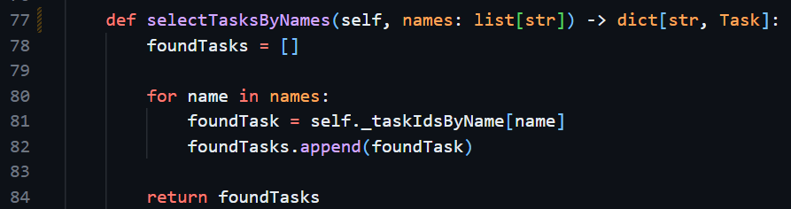

White box testing prior to any program executions revealed that incorrect values were returned by some model.selectX functions. Adding typehints revealed the discrepency: they returned their tasks as ids rather than full task values. While the controller could handle retrieving each task by its id, this would violate separation of concerns. Therefore, the functions should return their tasks directly.  shows the function should return a task, but only retrieves the id. Similarly, the function should return a dictionary rather than a list to allow for efficient retrieval by the controller if necessary