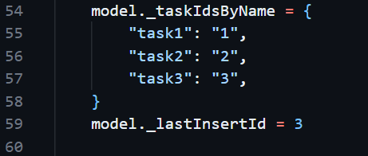
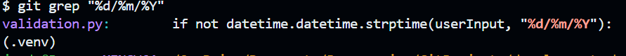
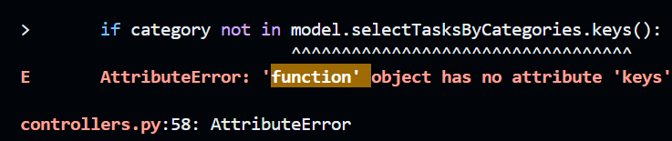
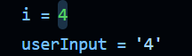
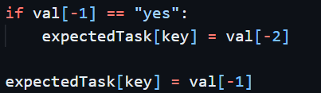
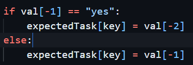
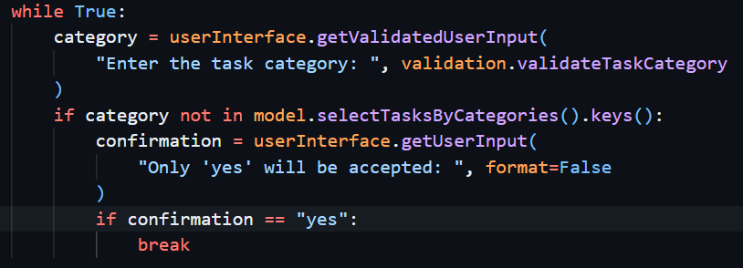

| Test # | Suite name | Status | Investigation & issue found | Actions | Evidence |
| --- | --- | --- | --- | --- | --- |
| 1 | testModel | Failed | All tests found an AttributeError: 'dict' object has no attribute 'tasksById'. This indicates that something is going wrong in the model's initialisation. Noticed that this would apply to saving too, so the Task's __dict__ attribute is called when dumping to json | Added dict -> Task translation to loadTasks |  |
| 2 | test_taskModel | Failed | Most tests found a "KeyError: 1" or similar, referring to the id | Treat ids as strings rather than integers |  |
| 3 | test_taskModel | Failed | testInsertTask found "KeyError: '4'" when reading from self._tasksById. Print debugging found that the new task's id wa incorrectly being set to 1 rather than 4 | Update dummyModel definition to update lastInsertId |  
| 4 | test_taskModel | Passed | | | | |
| 5 | test_controllers | Failed (3 passed) | Many tests found a "ValueError: time data '' does not match format '%d/%m/%Y'". Error message indicates that this only happens with empty inputs, which should be allowed for this input. Grep for formatting in files showed it was in validateTaskDeadline | Made datetime formatting conditional on a non-empty input in validateTaskDeadline | |
| 6 | test_controllers | Failed (3 passed) | Many tests found a "AttributeError: 'function' object has no attribute 'keys'". Searching for message in logs revealed incorrect syntax where a model method was being treated as its return value | | |  |
| 7 | test_controllers | Failed (3 passed) | Many tests found a "KeyError: 'category1'". The error happened in model.selectTasksByCategories when the category was not yet discovered in tasksById | Use safer .get() function to prevent always finding a keyError | Controllers (L58) Before: ```if not categorised[task.category]:```, After: ```if not categorised.get(task.category):``` |
| 8 | test_controllers | Failed (6 passed) | Update task, create task and viewTaskByName tests sometimes failed with "Expected a task object, but actual was None.". Investigation into the function responsible for governing retrieval, validateExistingTaskName, found that it returned None on success, compared to validateExistingTaskId, which returns its value | Make validateExistingTaskName return the found task on success | |
| 9 | test_controllers | Failed (7 passed) | Update task and create task tests sometimes failed with "Expected a task object, but actual was None.". Error logs showed that the assertion was from assertTaskHasSameValues. Other tests using that helper worked, so it was the controllers.py or test_controllers.py logic. WB investigation found update tests mistakenly did not include the id in userInputs | Place id in a list for update tests. Continue with manual testing | |
| 9m1 | Update task (normal) | Failed | Recieved invalid menu input error on main menu | Cast i as str before comparing to task id |  | 
| 9m2 | Update task (normal) | Failed | Data wasn't saved and the task wasn't outtputed. Noticed that tasks were never saved. Tracing return values showed that model.updateTask does not return the new task as would usually be expected | Add autosave to controllers. Add return statement to model.updateTask | |
| 9m3 | Update task (normal) | Passed | Data was passed to json store and new task information was printed to the screen | | |
| 10 | test_controllers | Failed (10 passed) | userInputs ran out of inputs, suggesting that validation incorrectly failed. Noticed that it would be creating a new category and would require confirmation | Add a "yes" input to category input lists where it is a new name | |
| 11 | test_controllers | Failed (10 passed) | userInputs ran out of inputs, suggesting that validation incorrectly failed | Use manual testing | | 
| 11m1 | Create task (minimum fields) | Failed | When creating the category, it did not allow me to leave the task uncategorised | Only perform length validation if the field is given | |
| 11m2 | Create task (minimum fields) | Passed | | | |
| 12 | test_controllers | Failed (10 passed) | Many tests found "AssertionError: Task mismatch:". This was accompanied by an expected task where category="yes". Examining the code found that the protection from using confirmations as values was overwritten after the conditional statement. | Place failed condition path in an else statement |  
| 13 | test_controllers | Failed (16 passed) | 2 "extremeUpper" tests found "ValueError: time data 'aaaaaaaaaaaaaaaaaaaaaaaaaaaaaaaaaaaaaaaaaaaaaaaaaaaaaaaaaaaaaaaaaaaaaaaaaaaaaaaaaaaaaaaaaaaaaaaaaaaaaaaa...", indicating that some inputs were passed incorrectly by tests. Examining the tests, inputs and handling is accurate, indicating that validation is allowing too-long description values through | Adjust maximum value in validateTaskDescription to be 255 rather than 256 | |
| 14 | test_controllers | Failed (18 passed) | No task was returned by testCreateTaskDontConfirmCategory. White box examination revealed no obvious input faults | Use manual testing | |
| 14m1 | Create task (dont confirm category) | Failed | The user is sent straight back to the main menu, instead of being allowed to change the category they want to enter. White box examination showed that controllers.createTask simply returned on non confirmation. I questioned why this wasn't also an issue in updateTask. Upon examination, I noticed that it doesn't have any confirmation logic at all | Encase category selection logic in a while loop that breaks on confirmation. Update dontConfirmCategory tests to input different category names | |
| 14m2 | Create task (dont confirm category) | Failed | The user is, as expected, asked to repeat their input when not confirming. However, existing categories now ask the user for a category forever | Add additional else:break clause to break if the category already exists | |
| 14m3 | Create task (dont confirm category) | Passed | The user is, as expected, asked to repeat their input when not confirming and existing categories no longer loop forever | | |
| 15 | test_controllers | Failed (18 passed) | Update task with lower extreme inputs prematurely exhausts its inputs. As this only started failing after the last change, it is likely due to the new category selection logic. As controllers.updateTask did not previously confirm category selections at all, indicating that the test may not have a confirmation input. This was correct | Add "yes" as the final category input in testUpdateTaskExtremeLower | |
| 16 | test_controllers | Passed | | | |

# Lessons
| Test # | Lesson |
| --- | --- |
| 1 | Make sure to think about how your custom classes will interact with other packages |