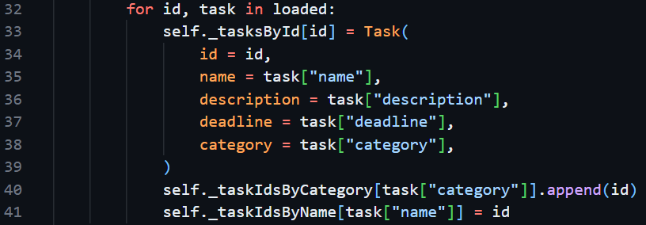
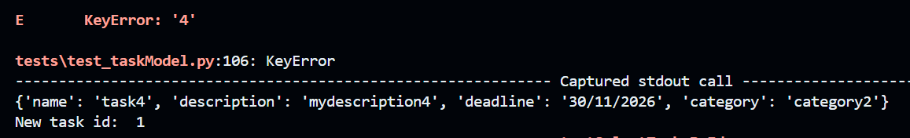

| Test # | Suite name | Status | Investigation & issue found | Actions | Evidence |
| --- | --- | --- | --- | --- | --- |
| 1 | testModel | Failed | All tests found an AttributeError: 'dict' object has no attribute 'tasksById'. This indicates that something is going wrong in the model's initialisation. Noticed that this would apply to saving too, so the Task's __dict__ attribute is called when dumping to json | Added dict -> Task translation to loadTasks |  |
| 2 | test_taskModel | Failed | Most tests found a "KeyError: 1" or similar, referring to the id | Treat ids as strings rather than integers |  |
| 3 | test_taskModel | Failed | testInsertTask found "KeyError: '4'" when reading from self._tasksById. Print debugging found that the new task's id wa incorrectly being set to 1 rather than 4 | Update dummyModel definition to update lastInsertId |  
| 4 | test_taskModel | Passed | | | | 

# Lessons
| Test # | Lesson |
| 1 | Make sure to think about how your custom classes will interact with other packages |