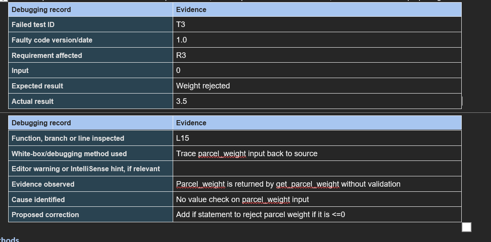
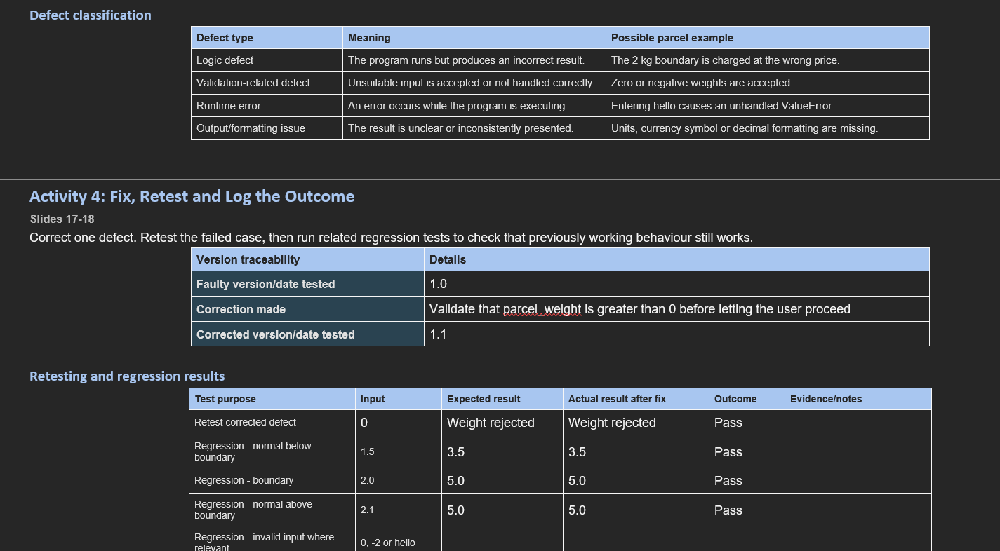
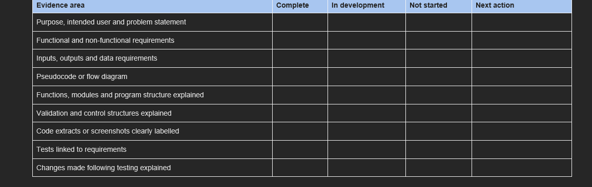

# Investigation methods
•	Compare the code with the stated requirement.
•	Inspect conditions, branches, loops and validation logic.
•	Read runtime errors and line numbers.
•	Trace variable values or add temporary print statements.
•	Use a breakpoint or step-through debugging.
•	Review editor warnings, syntax highlighting or IntelliSense hints where relevant.

# White box technique documentation

# Things to review
